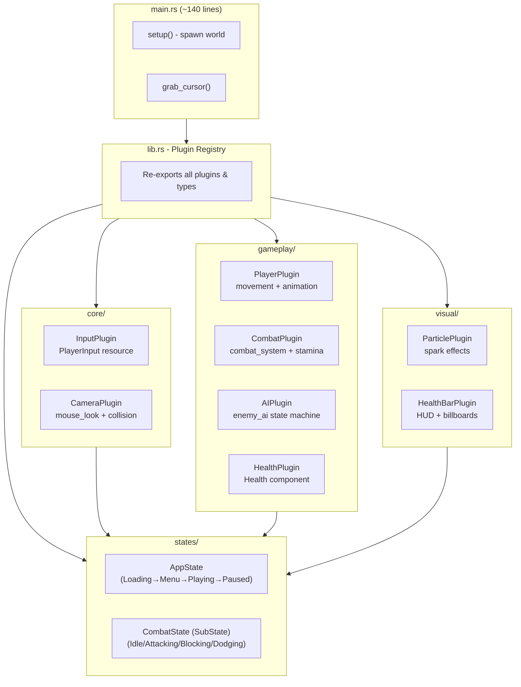

# Architecture

This document describes the modular plugin-based architecture of the game.

## Overview

The codebase follows Bevy 0.15 best practices with a plugin-based architecture. Each major system is encapsulated in its own plugin, making the code modular and maintainable.

```
src/
├── main.rs              # Entry point (~140 lines)
├── lib.rs               # Plugin registry and exports
├── states/
│   └── mod.rs           # AppState, CombatState
├── core/
│   ├── mod.rs
│   ├── input.rs         # PlayerInput resource
│   └── camera/
│       ├── mod.rs       # CameraPlugin
│       ├── follow.rs    # mouse_look system
│       └── collision.rs # Camera collision detection
├── gameplay/
│   ├── mod.rs
│   ├── health.rs        # Health component + HealthPlugin
│   ├── player/
│   │   ├── mod.rs       # PlayerPlugin
│   │   ├── components.rs
│   │   ├── movement.rs
│   │   └── animation.rs
│   ├── combat/
│   │   ├── mod.rs       # CombatPlugin
│   │   ├── components.rs
│   │   ├── system.rs
│   │   ├── hit.rs
│   │   └── stamina.rs
│   └── ai/
│       ├── mod.rs       # AIPlugin
│       ├── components.rs
│       └── state_machine.rs
└── visual/
    ├── mod.rs
    ├── particles.rs     # ParticlePlugin
    └── health_bar.rs    # HealthBarPlugin
```

## Plugin Dependency Graph



## State Management

### AppState (Primary State)

Controls the main game flow:

| State | Description |
|-------|-------------|
| `Loading` | Initial state, transitions immediately to Playing (will be used for asset loading) |
| `Menu` | Main menu (not yet implemented) |
| `Playing` | Active gameplay |
| `Paused` | Game paused (not yet implemented) |

### CombatState (SubState)

Only active when `AppState::Playing`. Controls combat behavior:

| State | Description |
|-------|-------------|
| `Idle` | Default state, can move freely |
| `Attacking` | During attack animation |
| `Blocking` | Holding block |
| `Dodging` | During dodge roll |
| `Stunned` | After taking hit |

## Plugins

### Core Plugins

#### InputPlugin (`core/input.rs`)
- Initializes `PlayerInput` resource
- Reads keyboard/mouse input each frame
- Only runs in `AppState::Playing`

```rust
pub struct PlayerInput {
    pub movement: Vec3,      // WASD normalized
    pub attacking: bool,     // Left mouse
    pub blocking: bool,      // Right mouse
    pub jumping: bool,       // Space
    pub sprinting: bool,     // Shift
    pub camera_delta: Vec2,  // Mouse motion
}
```

#### CameraPlugin (`core/camera/`)
- `mouse_look` - Updates `PlayerYaw` from mouse input
- `camera_follow_with_collision` - Third-person camera with Rapier raycast collision detection

### Gameplay Plugins

#### PlayerPlugin (`gameplay/player/`)
- `player_movement` - WASD movement, sprint, jump using `KinematicCharacterController`
- `load_animations` - Loads animation clips from Knight.glb
- `setup_character_animations` - Attaches animation graph to entities

#### CombatPlugin (`gameplay/combat/`)
- `combat_system` - Hit detection, blocking, damage application
- `HitEvent` - Event for spawning impact effects
- `Stamina` component (structure ready, not yet integrated)

#### AIPlugin (`gameplay/ai/`)
- `enemy_ai` - State machine (Idle → Patrol → Chase → Attack)
- Uses player detection range and attack range constants

#### HealthPlugin (`gameplay/health.rs`)
- `Health` component with current/max
- `despawn_dead_enemies` - Removes enemies after death animation

### Visual Plugins

#### ParticlePlugin (`visual/particles.rs`)
- `spawn_impact_sparks` - Creates spark particles on `HitEvent`
- `update_particles` - Physics update and lifetime management

#### HealthBarPlugin (`visual/health_bar.rs`)
- `setup_player_health_ui` - HUD health bar at top-left
- `spawn_enemy_health_bars` - World-space billboard health bars
- `update_enemy_health_bars` - Billboard orientation and scaling

## Key Patterns

### State-Conditional Systems

All gameplay systems use `run_if(in_state(AppState::Playing))`:

```rust
app.add_systems(
    Update,
    player_movement.run_if(in_state(AppState::Playing)),
);
```

### Component vs Resource

| Type | Usage |
|------|-------|
| **Component** | Per-entity data (Health, CombatStatus, EnemyAi) |
| **Resource** | Global singletons (PlayerInput, PlayerYaw, GameAnimations) |

### Event-Driven Effects

Visual effects use events to decouple systems:

```rust
// Combat system sends event
event_writer.send(HitEvent { position, blocked: false });

// Particle system receives and spawns sparks
for event in event_reader.read() {
    // spawn particles at event.position
}
```

## Adding New Features

1. **New system in existing plugin**: Add to the plugin's `mod.rs`
2. **New plugin**: Create module, define plugin struct, add to `lib.rs`
3. **New state**: Add variant to `AppState` or create new `SubState`
4. **Cross-plugin communication**: Use events or shared resources
